---
lab:
    title: 'Lab: Validate lab environment'
    module: 'Module 0: Course introduction'
---

Module 0: Course introduction
=================================

## Exercise 1 – Setup

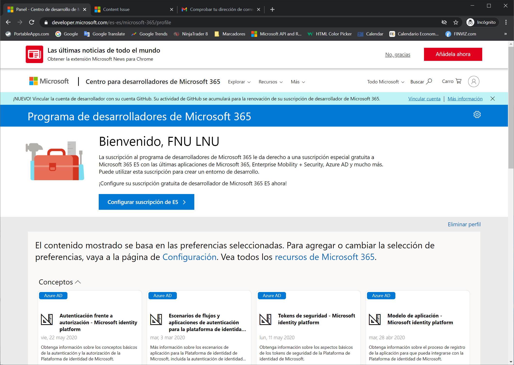

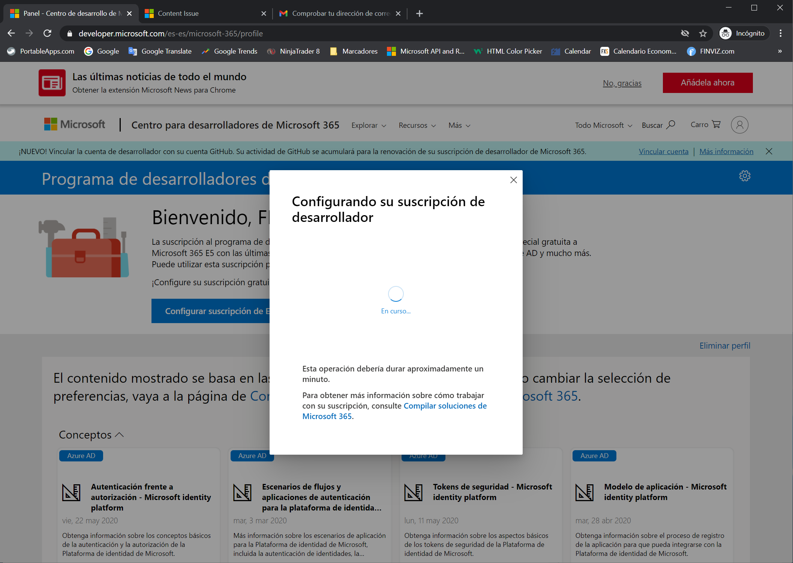

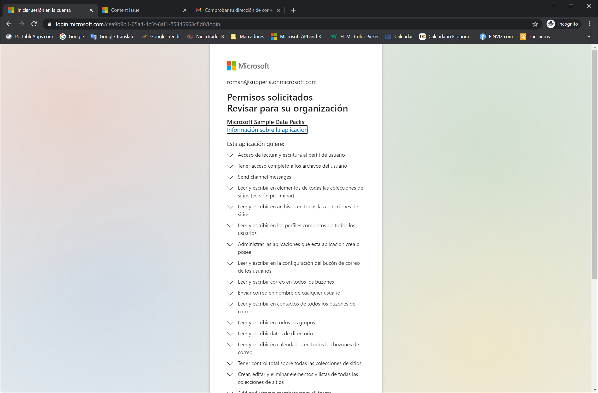

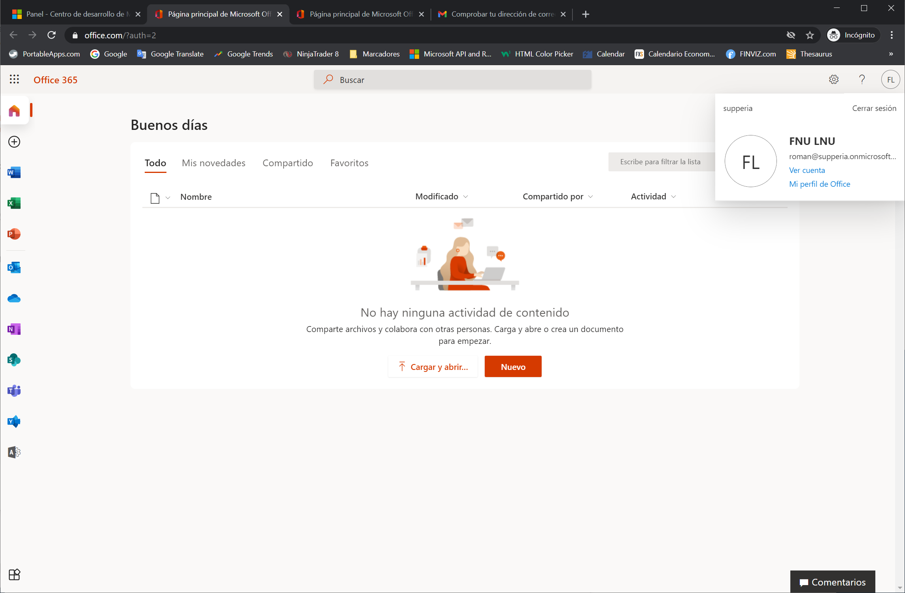

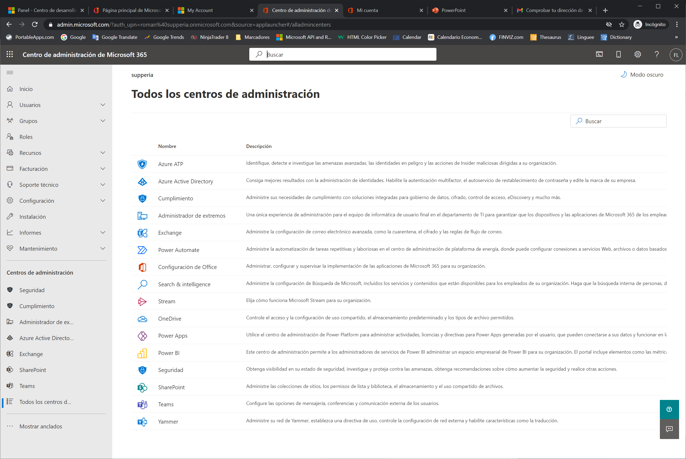

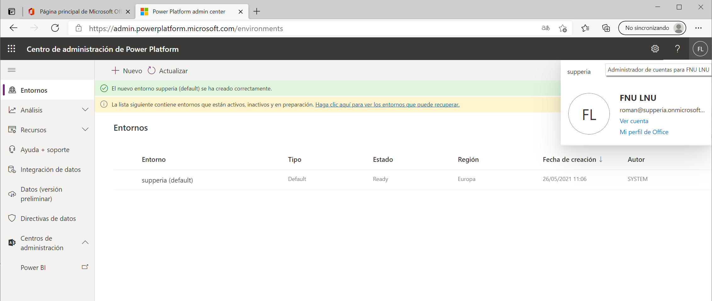

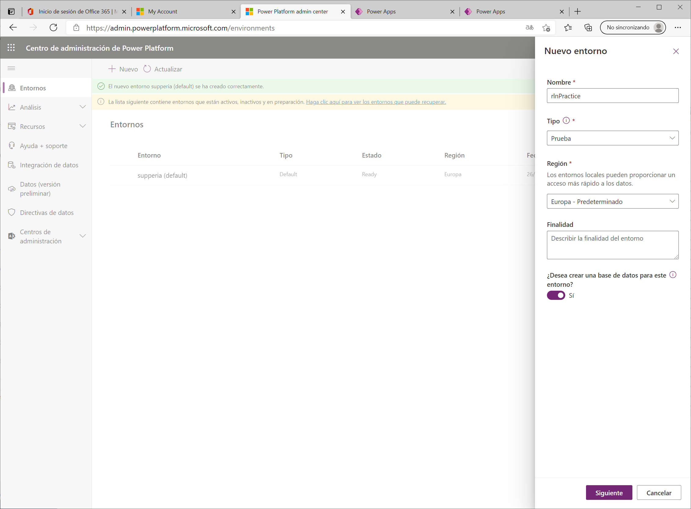

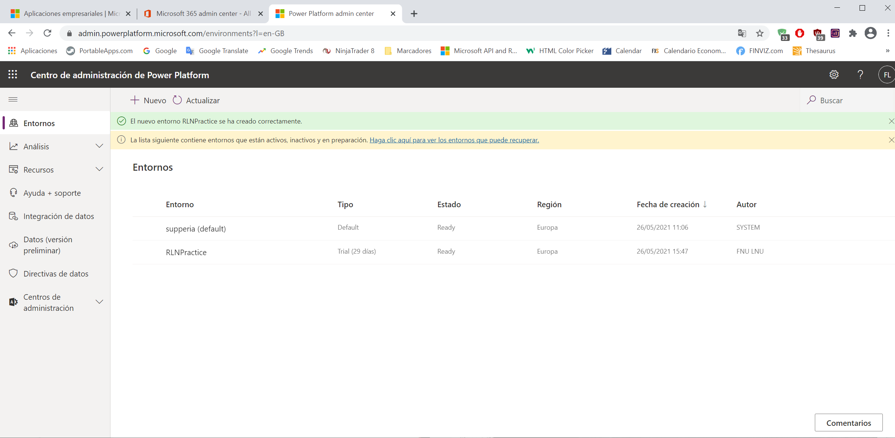

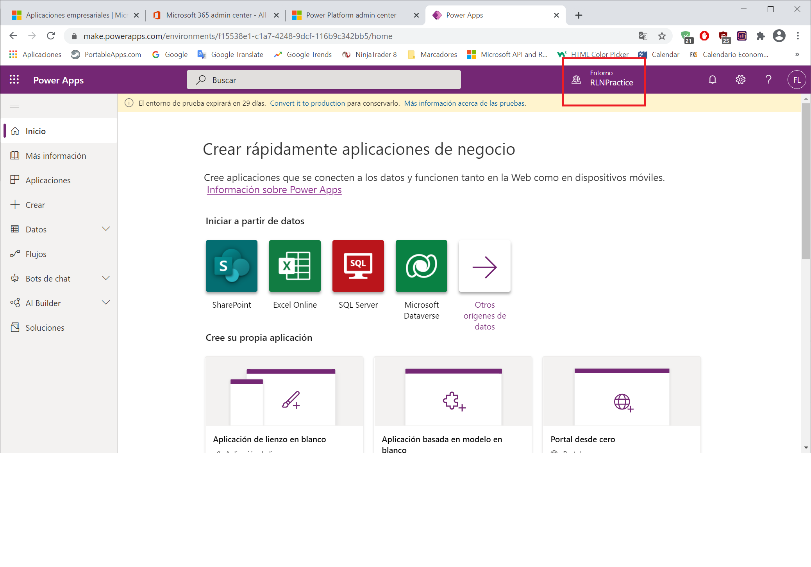

# Exercise \#2: Provision a Power Apps portal

## Task \#1: Create Power Apps portal

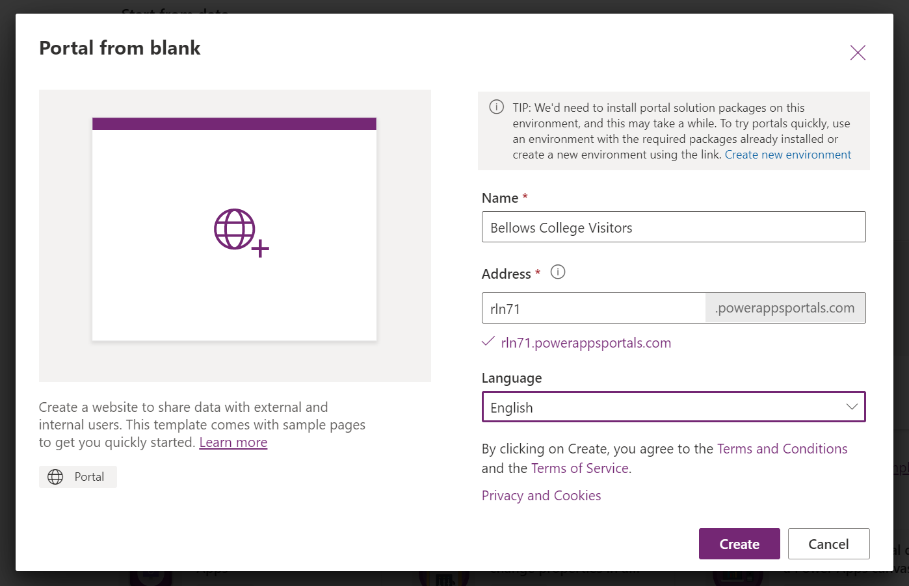

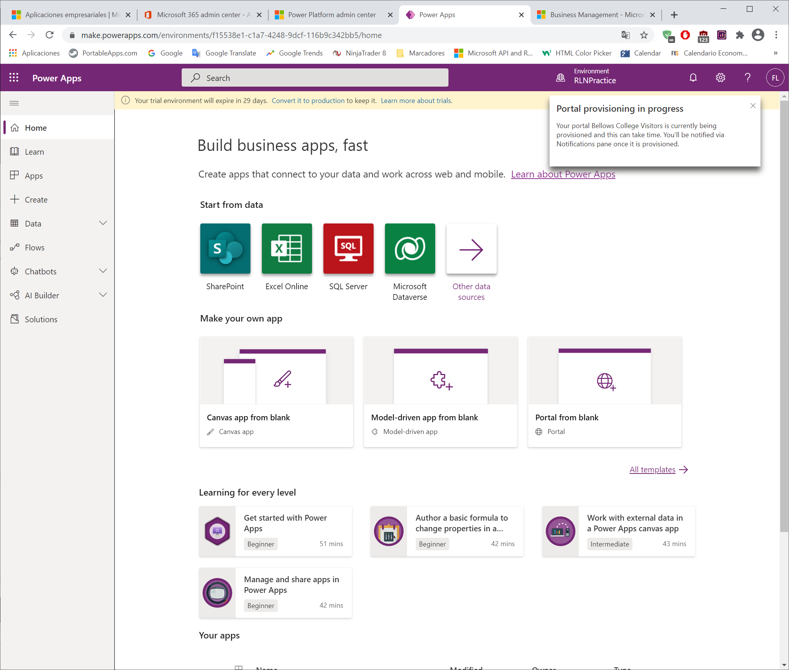
