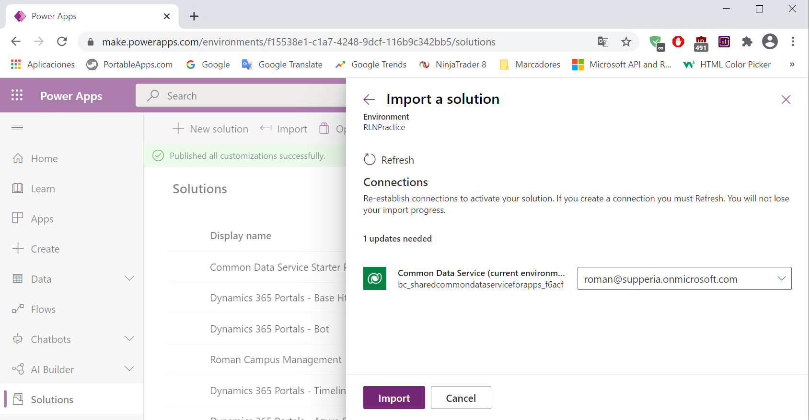

---
lab:
    title: 'Lab 1: Data Modeling'
    module: 'Module 2: Introduction to Microsoft Dataverse'
---

# Module 2: Introduction to Microsoft Dataverse
# Exercise \#1: Create Solution

## Task \#1: Create Solution and Publisher

# Exercise \#2: Add Existing and Create New Tables

**Objective:** In this exercise, you will add the standard Contact table and create new custom tables for Buildings and Visits in the solution. 

## Task \#1: Add Existing Table

1.  Click to open your **Campus Management** solution you just created.

2.  Click **Add Existing** and select **Table**.

3.  Locate **Contact** and select it.

4.  Click **Next**.

5.  Click **Select Components** under Contact.

6.  Select the **Views** tab and select the **Active Contacts** view. Click
    **Add**.
    
7.  Click **Select Components** again.

8.  Select the **Forms** tab and select the **Contact** form.
    
9.  Click **Add**.

    > You should have **1 View** and **1 Form** selected. 
    
10.  Click **Add** again. This will add the Contact table with the selected View and Form to the newly created solution. 
     
    
    > Your solution should now have one table: Contact.

## Task #2: Create Building Table

## Task #3: Create Visit Table and Columns

# Exercise \#3: Create Relationships

# Exercise \#4: Import Data

**Objective:** In this exercise you will import sample data into the Dataverse database.

## Task #1: Import solution

Hay un problema con el archivo **solution.xml** dentro del fichero **DataImport_managed.zip**   y es que el campo Publisher está establecido como *<UniqueName>bellowscollege</UniqueName>* cuando debería de ser *<UniqueName>BellowsCollege</UniqueName>*. Al hacer el import inicial no dio problemas y los datos se cargaron bien.

Después del import inicial advertí que me faltaba el campo **Code** en la la tabla **Visit** así que añadí el campo y repetí el import, pero esta vez sí falló a causa de que el *Publisher* no coincidía, así que tuve que editar el fichero *solution.xml* y cambiar el *Publisher* a *BellowsCollege*.

## Task #2: Import Data 

## Task #3: Verify Data Import

Tengo un problema con el campo **Code** de la tabla **Visit** y es que tras el segundo import el campo sigue vacío. Quizás haya que esperar más tiempo a que se refresquen los datos.

La columna **Code** no se llena, supongo que no se pueden importar registros con una *primary key* ya existente.

