---
lab:
    title: 'Lab 2: How to build a canvas app, Part 1'
    module: 'Module 3: Get started with Power Apps'
---

# Module 3: Get started with Power Apps

# Exercise \#1: Create Staff Canvas App

**Objective:** In this exercise, you will create a canvas app from a template and then modify it to include required data.

## Task \#1: Create Canvas App

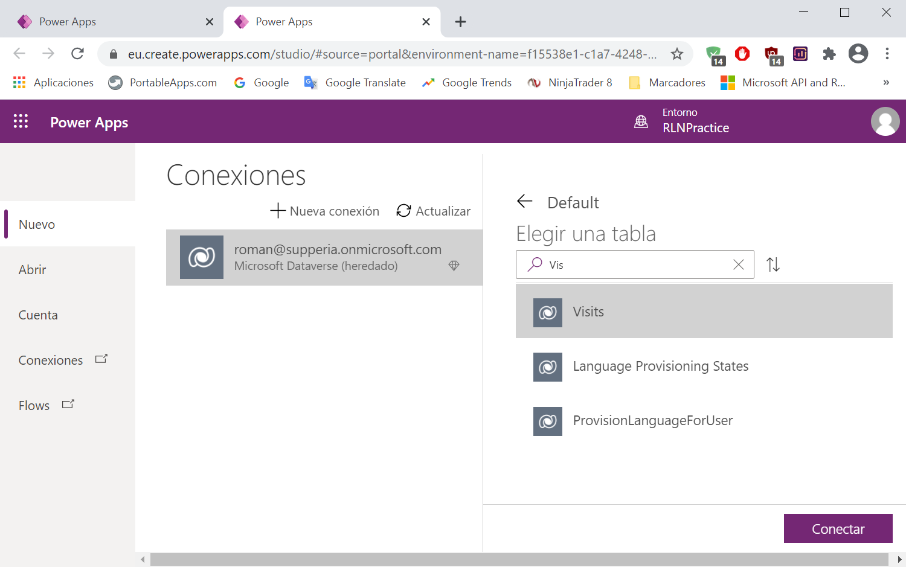

## Task \#2: Configure Visits Detail Form

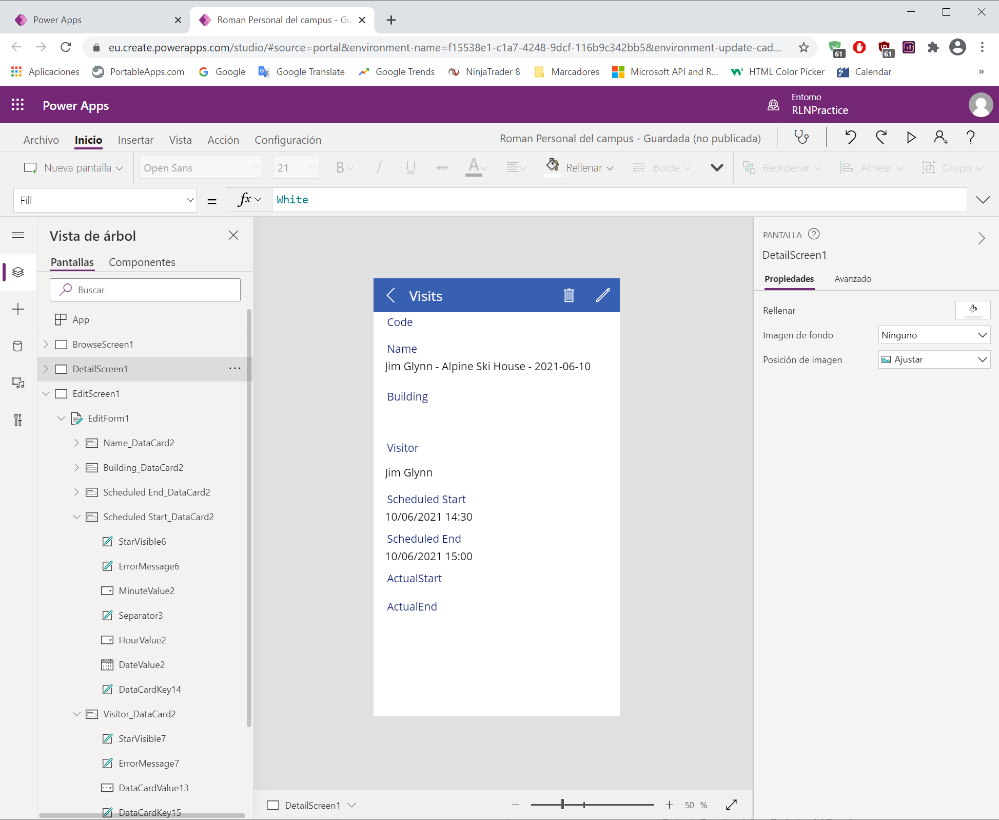

## Task \#3: Configure Visits Edit Form

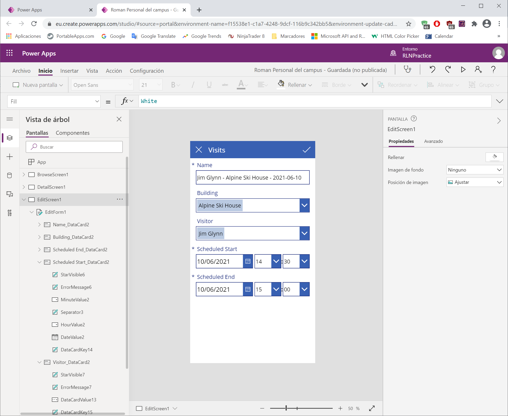

## Task \#4: Configure Visits gallery

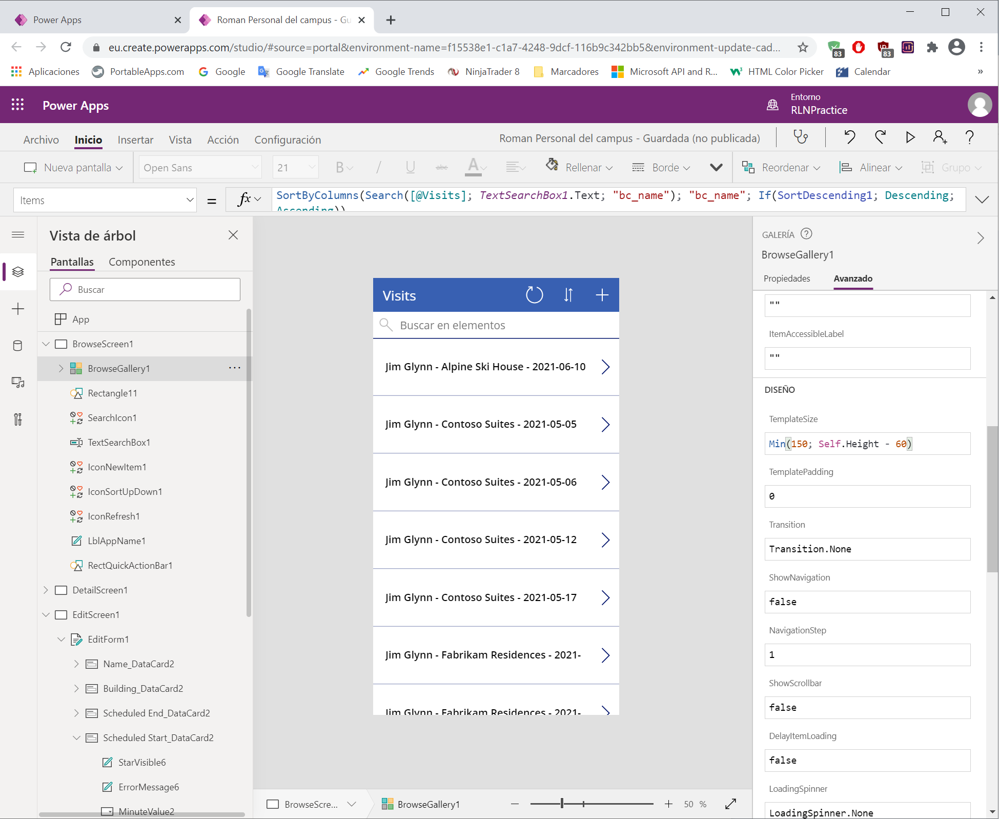

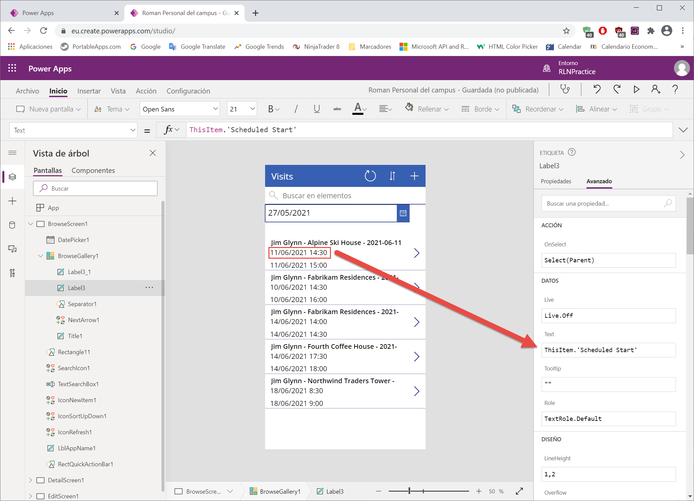

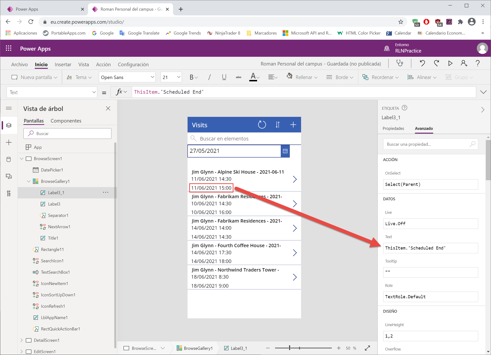

## Task #5: Add date filter

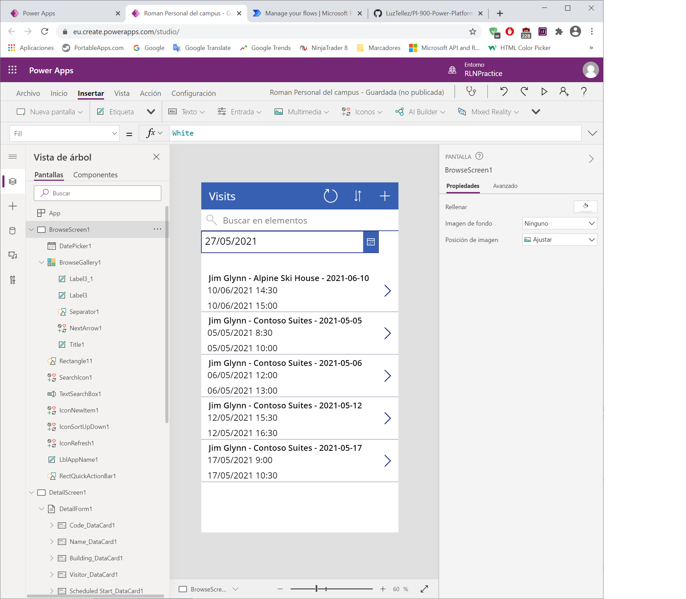

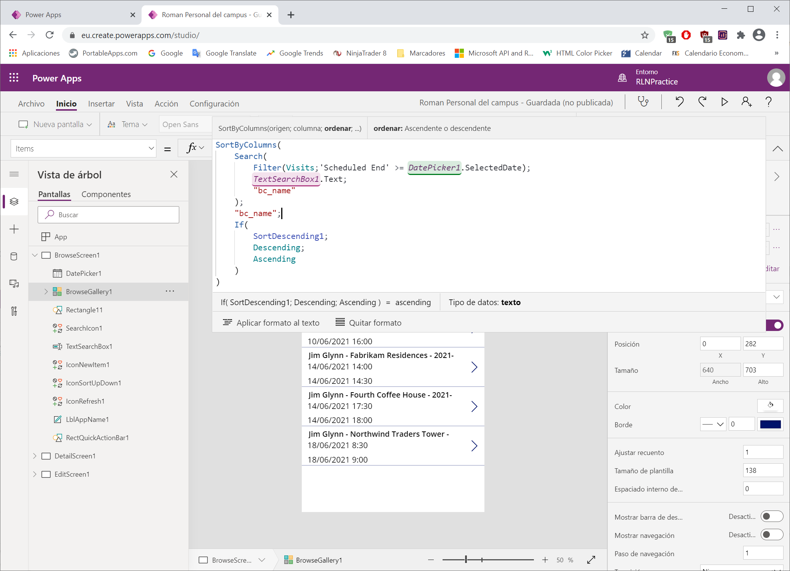

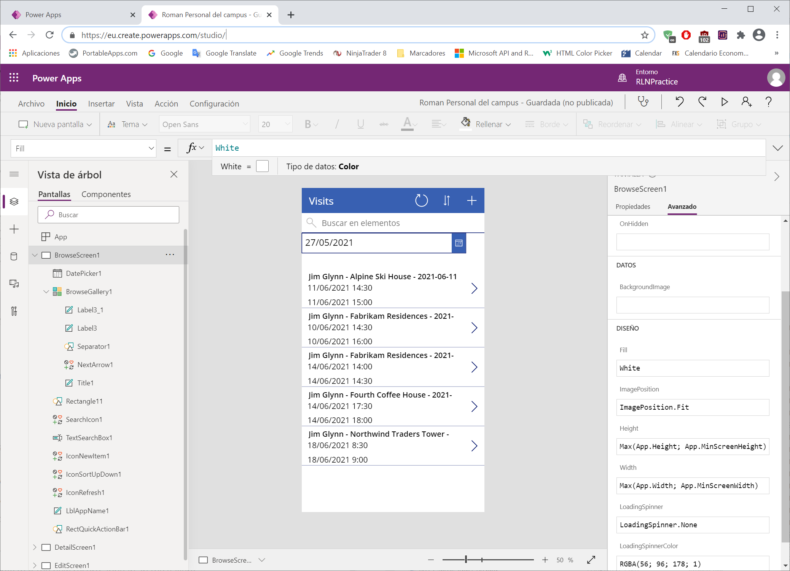

# Exercise #2: Complete the App

## Task \#1: Test App

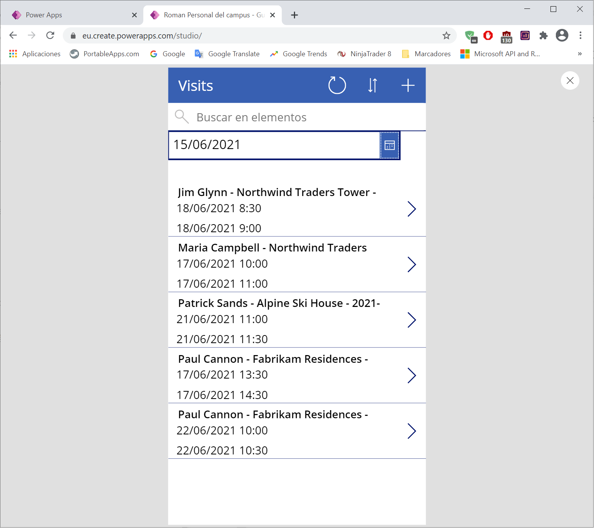

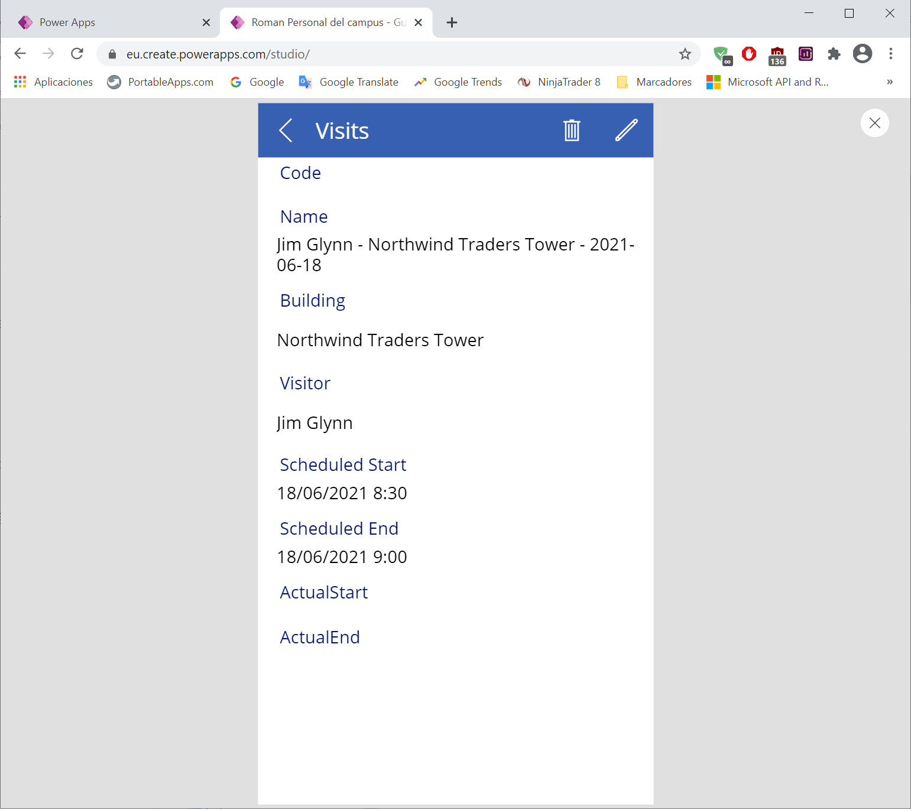

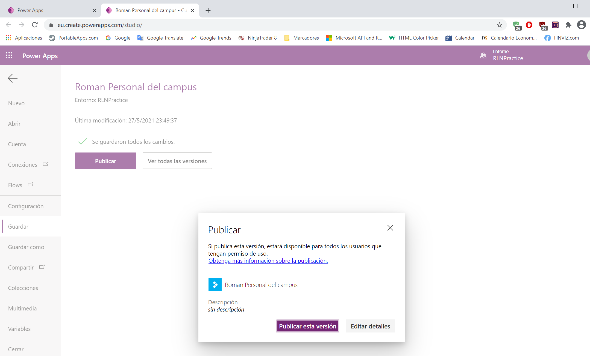

## Task #2: Add App to Solution and publish 

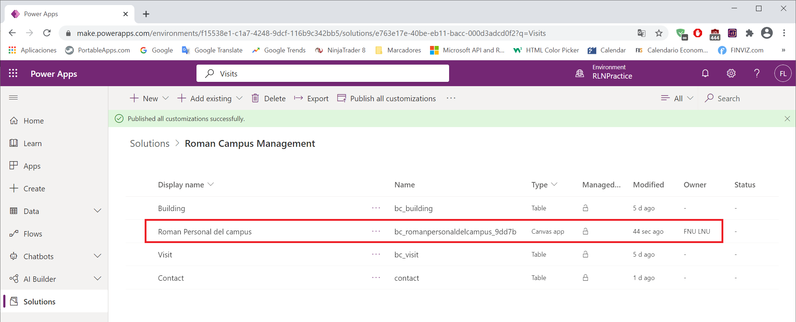
