---
lab:
    title: 'Lab 3: How to build a canvas app, part 2'
    module: 'Module 3: Get started with Power Apps'
---

# Module 3: Get started with Power Apps
## Lab 2: How to build a canvas app, part 2

# Exercise \#1: Create Security Canvas App

**Objective:** In this exercise, you will create a canvas app.

## Task \#1: Create Canvas App

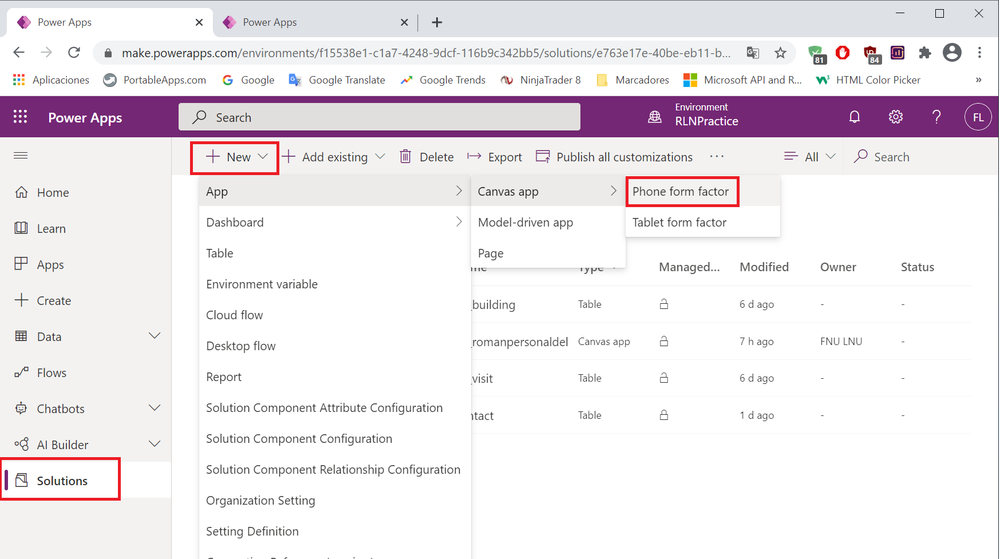

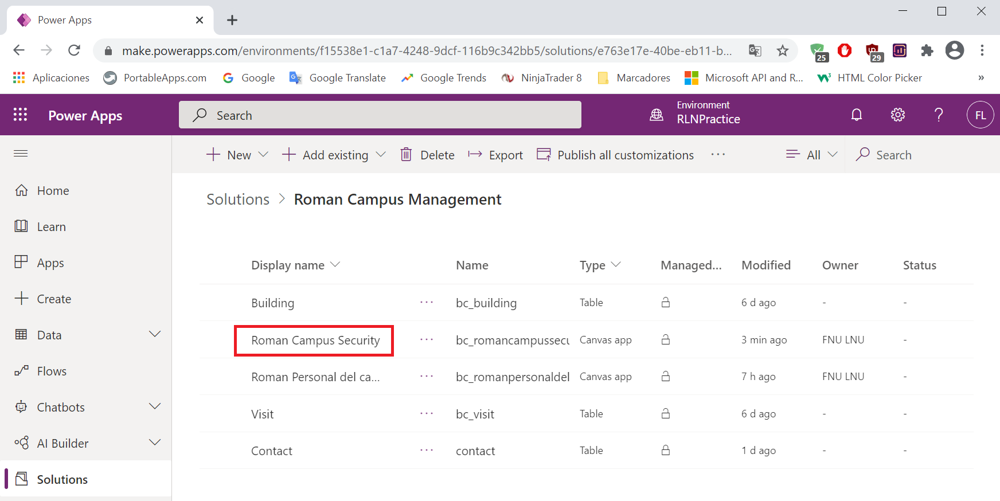

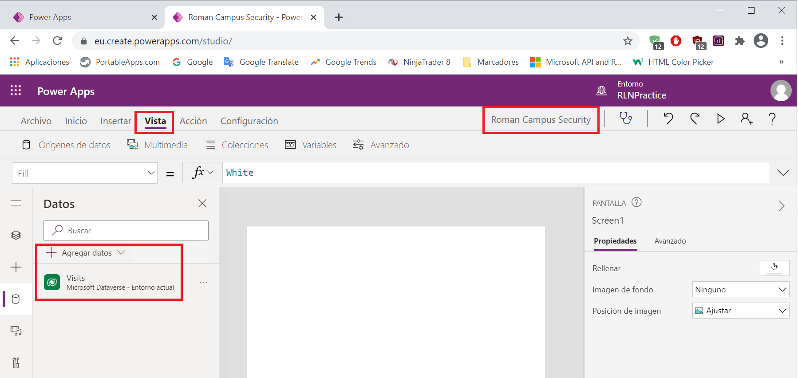

## Task \#2: Display Visitor information

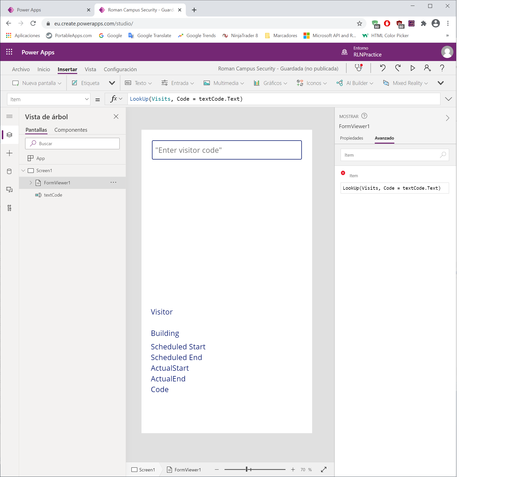

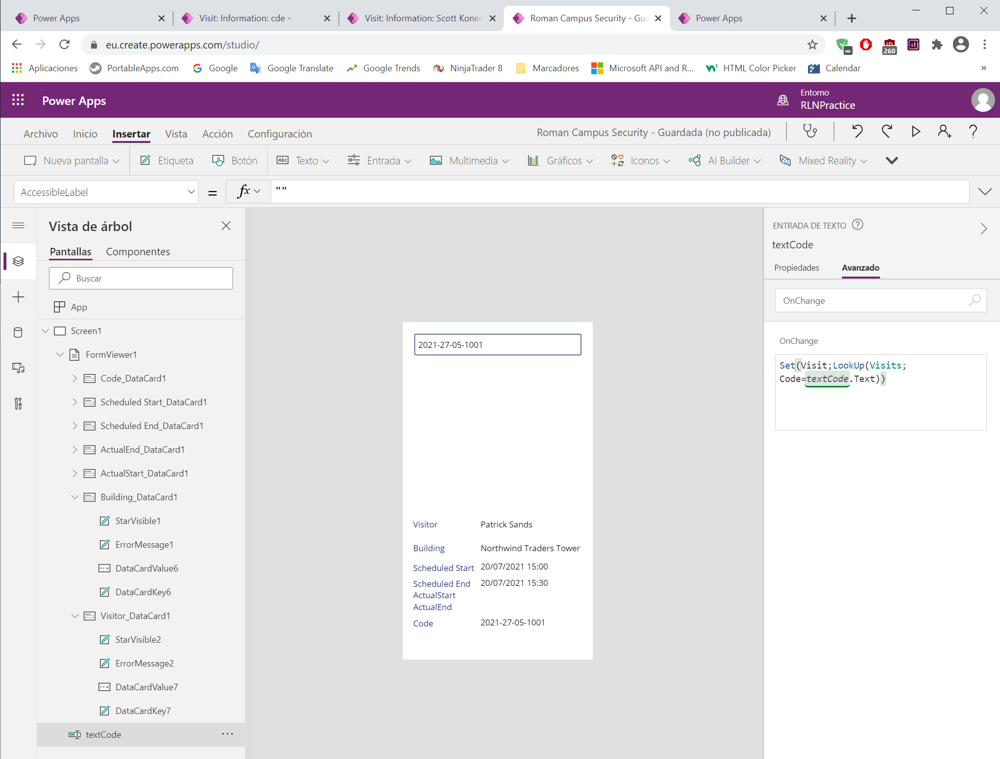

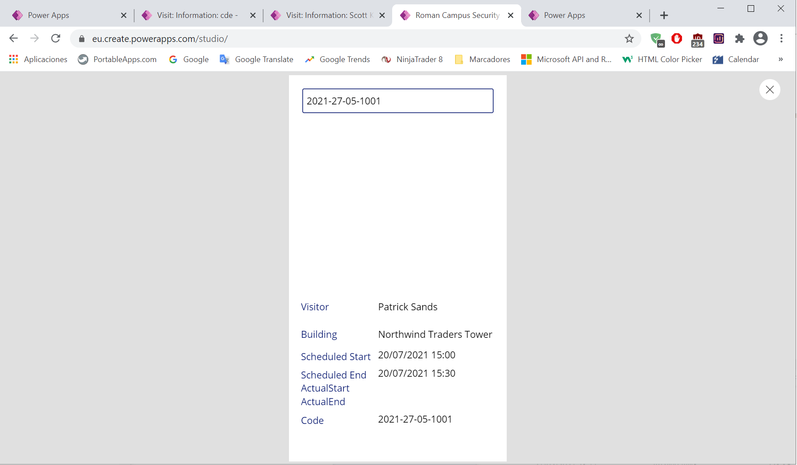

## Task \#3: Add Check In and Check Out Buttons

## Task \#4: Enable and disable buttons depending on visit data

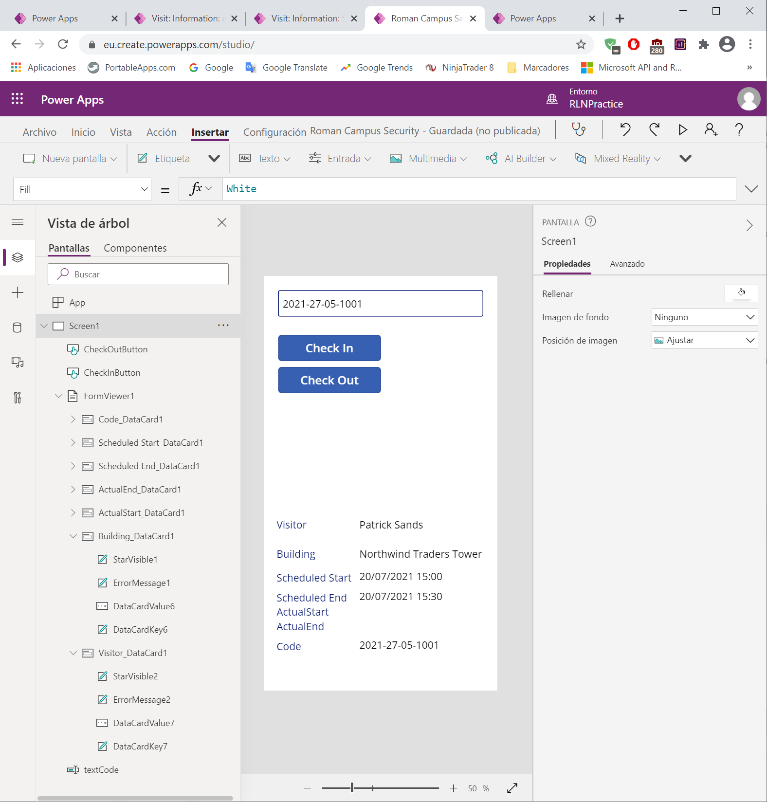

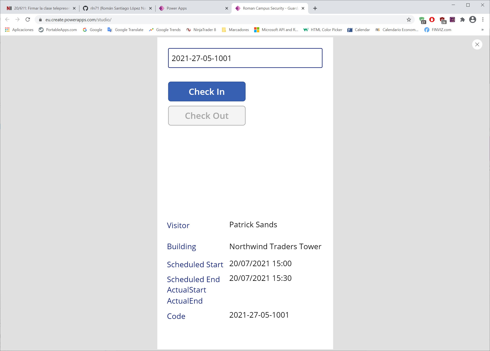

## Task \#5: Complete Check In and Check Out Process

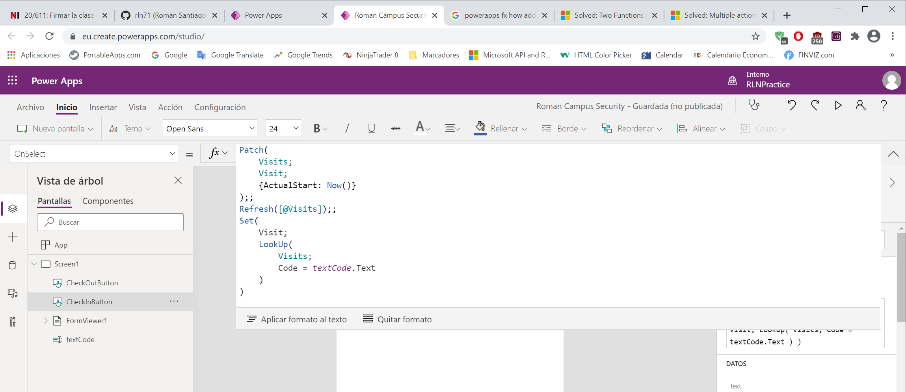

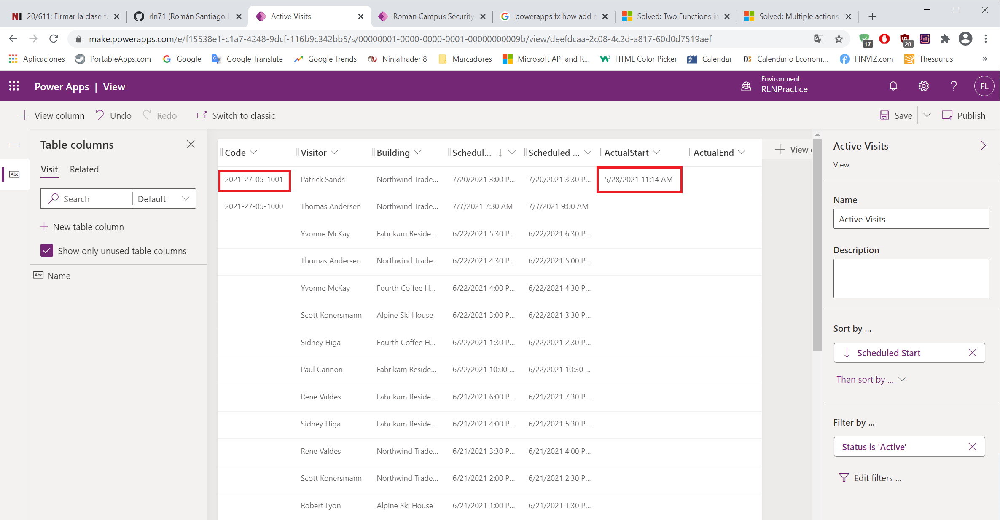

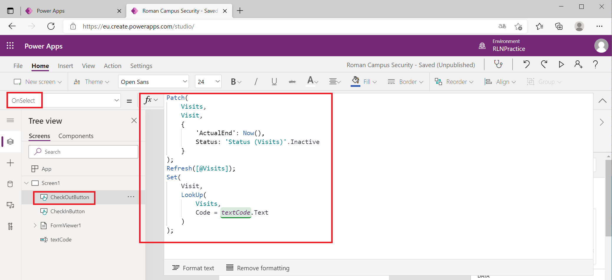

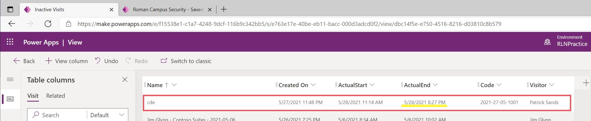

## Task \#6: Add visual indicators

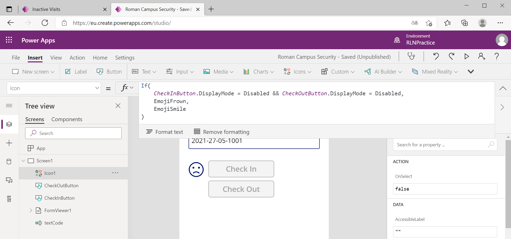

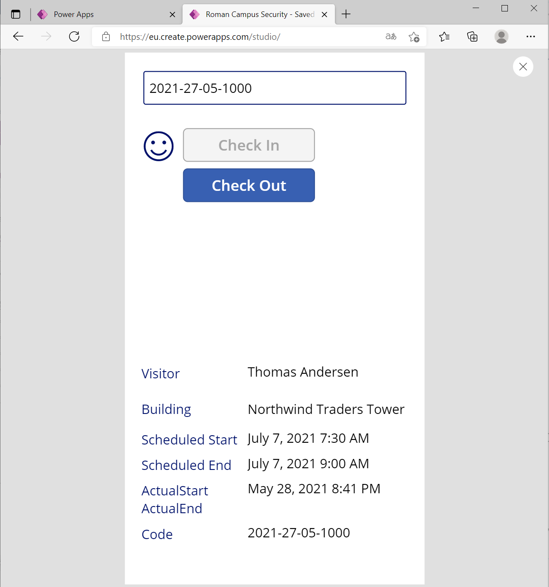

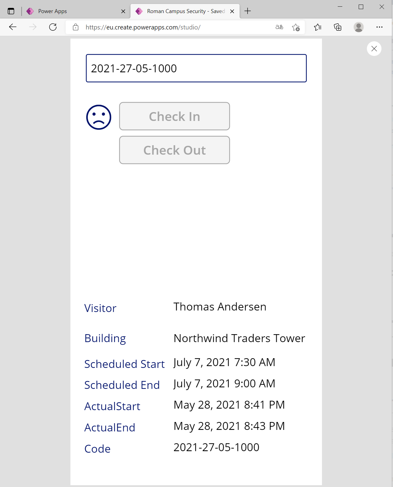

## Task #7: Publish the app
