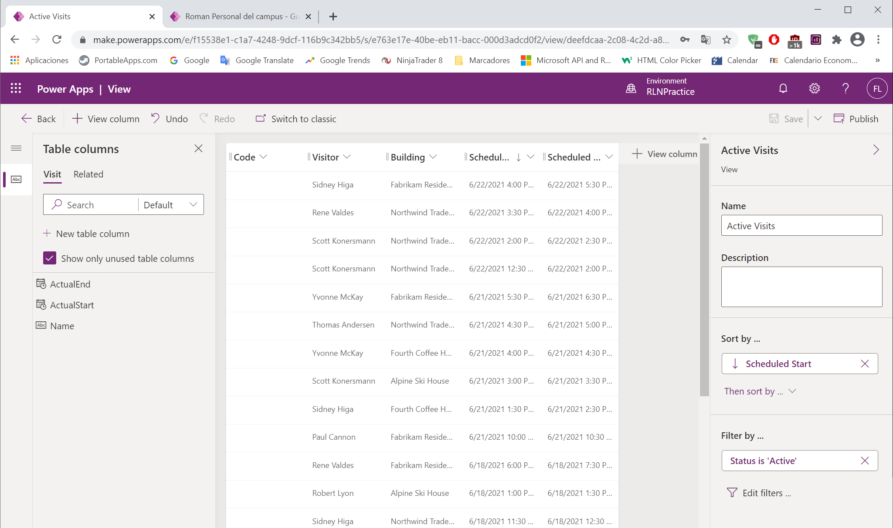

---
lab:
    title: 'Lab 4: How to build a model-driven app'
    module: 'Module 3: Get started with Power Apps'
---

# Module 3: Get started with Power Apps

# Exercise \#1: Customize Views and Forms

## Task \#1: Edit Visit Form

## Task \#2: Edit Visit Views

# Exercise \#2: Create Model-Driven Application

## Task \#1: Create Application

## Task \#2: Test Application

