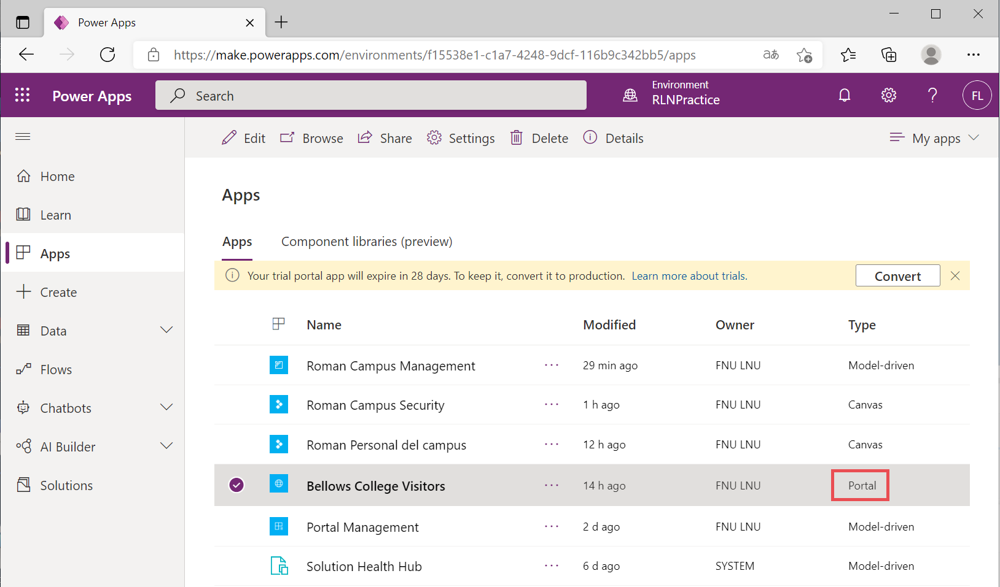
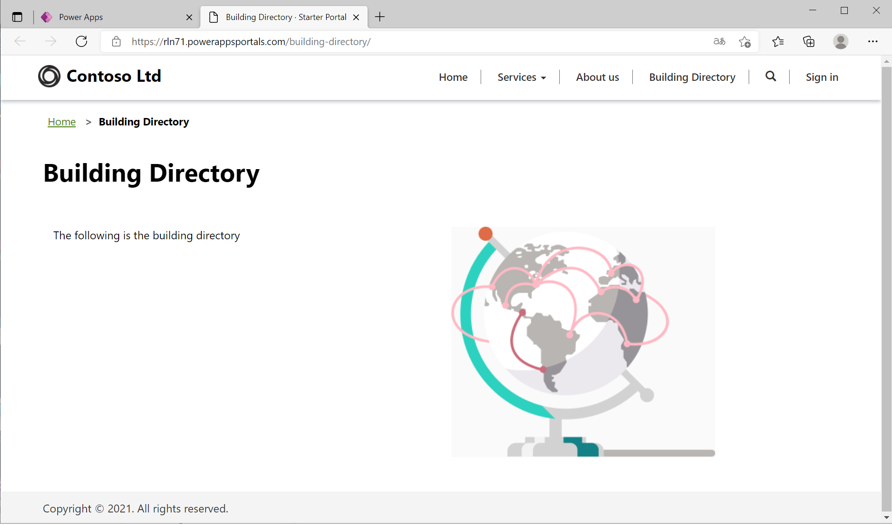
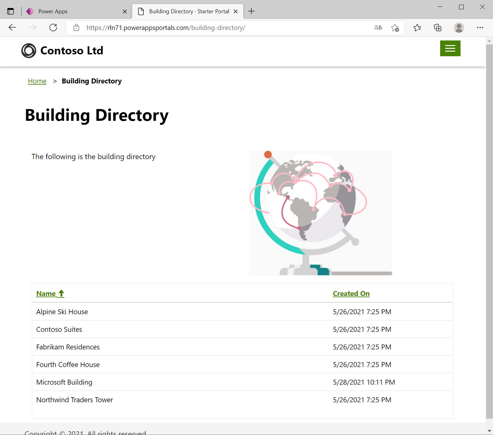
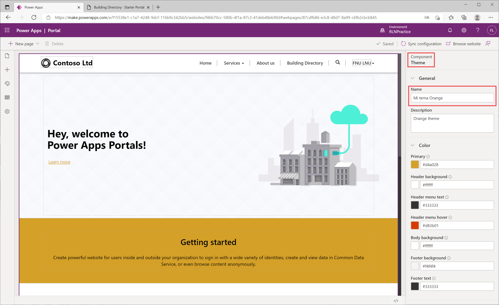

---
lab:
    title: 'Lab 5: How to build a Power Apps portal'
    module: 'Module 3: Get started with Power Apps'
---

# Module 3: Get started with Power Apps

# Exercise \#1: Create a Portal Webpage

**Objective:** In this exercise, you will create a new webpage that will display some static content as well as a list of buildings from Dataverse.

## Task \#1: Navigate to Portal

## Task \#2: Create a Webpage

## Task \#3: Add Static Content

## Task \#4: Add a List Component

# Exercise \#2: Change the Portal Theme

**Objective:** In this exercise, you will create a new theme that will alter the color scheme of your portal. 

## Task #1: Apply and Edit a Theme

