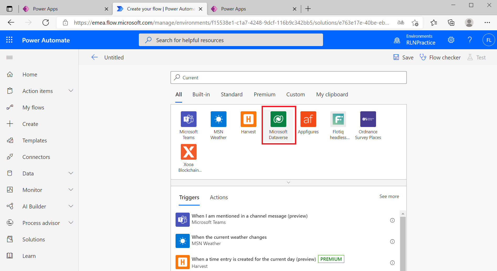
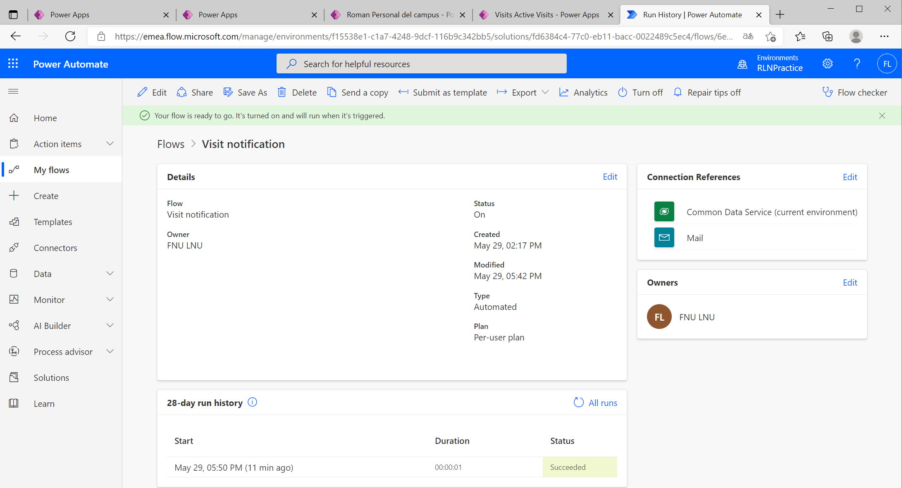

---

lab:
    title: 'Lab 6: How to build an automated solution'
    module: 'Module 4: Get Started with Power Automate'
---

# Module 4: Get Started with Power Automate
# Exercise \#1: Create Visit Notification flow

# Exercise #2: Create Security Sweep flow

# Challenges

* Add Actual Start and Scheduled End to the email body.
* How could you ensure user-friendly date formatting is used in the email body?
* Is it possible to generate a table with overstay information and send only a single email?
* Can you generate barcode for the visit code? When will that be useful?
