---
lab:
    title: 'Lab 7: How to build a simple dashboard'
    module: 'Module 5: Get Started with Power BI'
---

# Module 5: Get Started with Power BI
# Exercise \#1: Create Power BI Report 

## Task \#1: Install Power BI Desktop / Prepare Power BI service

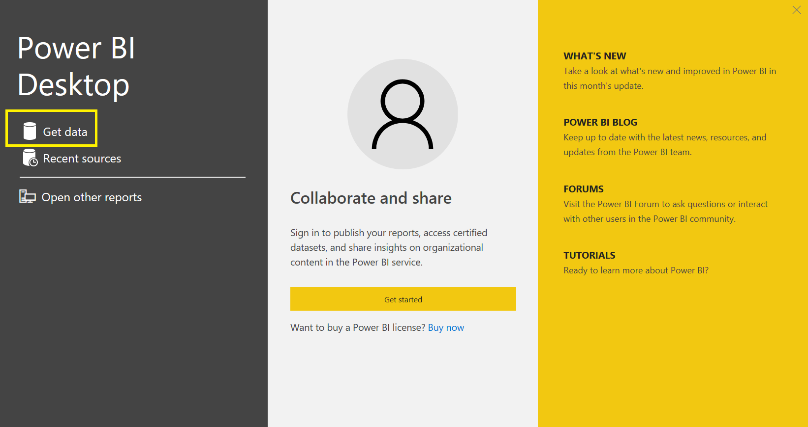

## Task \#2: Prepare Data

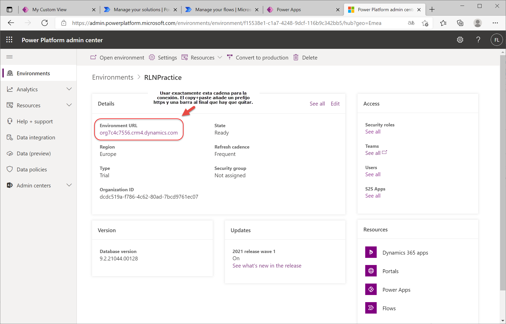

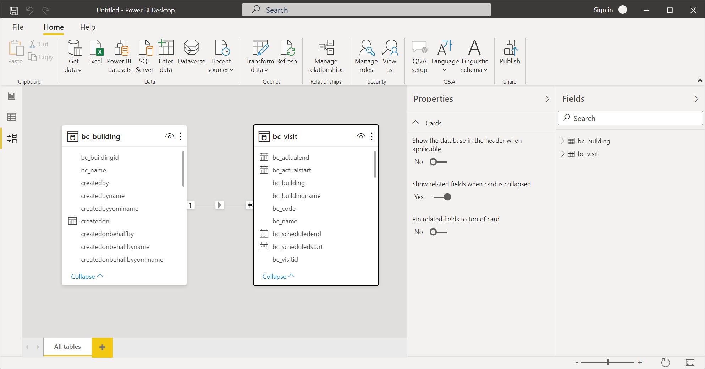

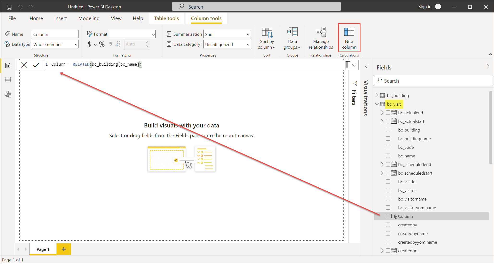

## Task #3: Create Chart and Time Visualizations

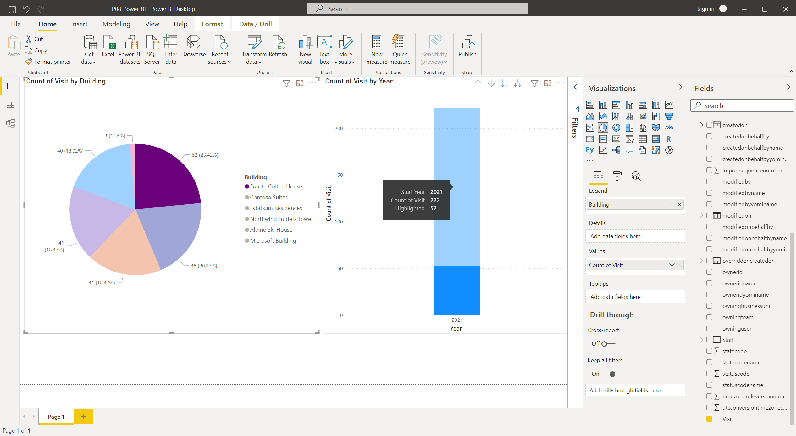

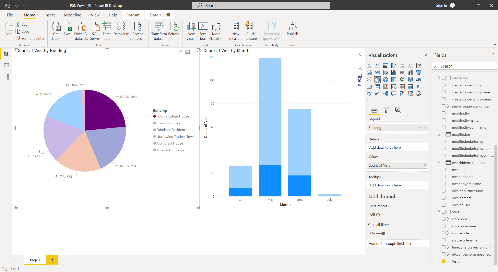

# Exercise #2: Create Power BI Dashboard

## Task #1: Publish Power BI Report

## 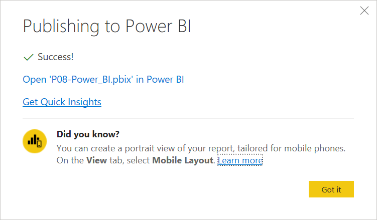

## Task #2: Create Power BI Dashboard

## Task #3: Add Visualizations Using Natural Language

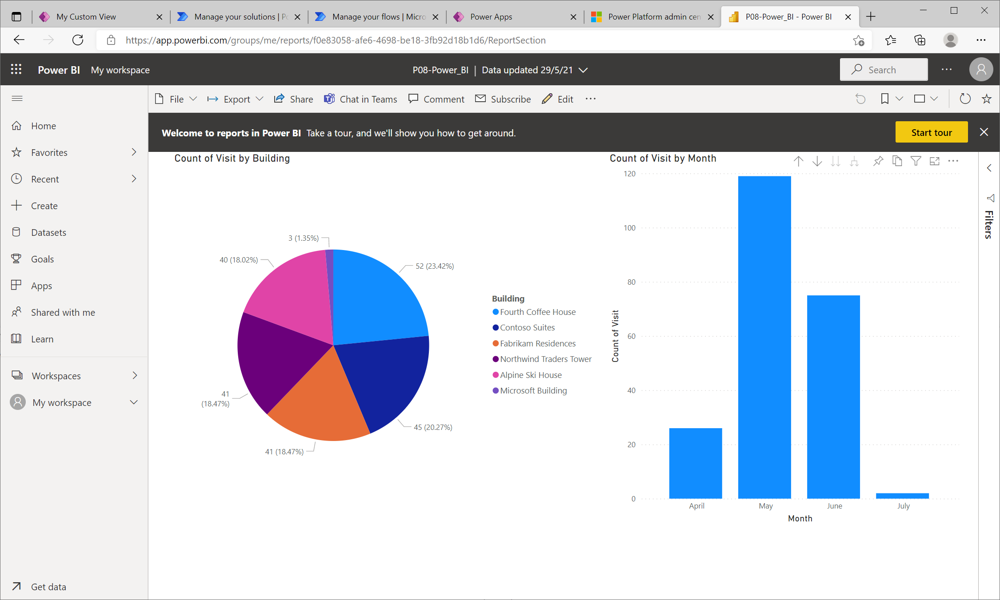

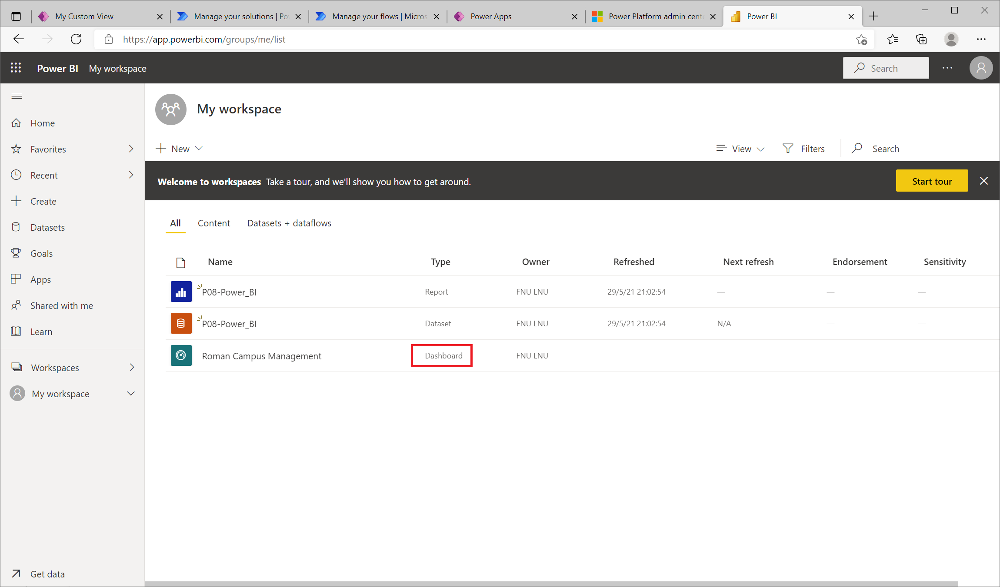

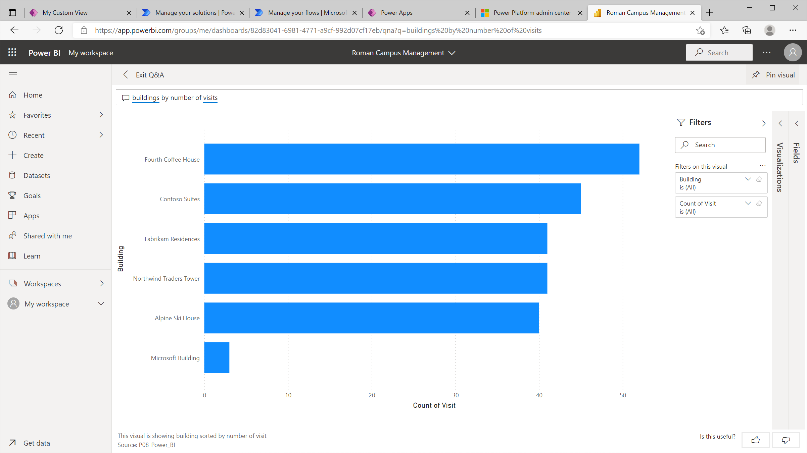

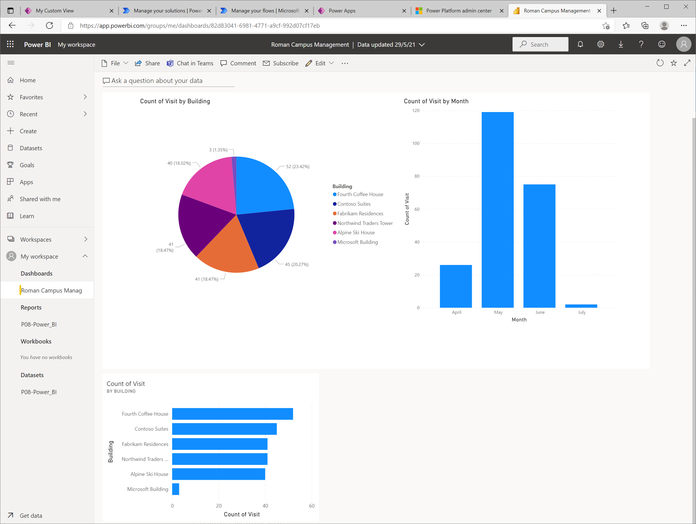

## Task #4: Build Mobile Phone View and Share a Report with a QR Code

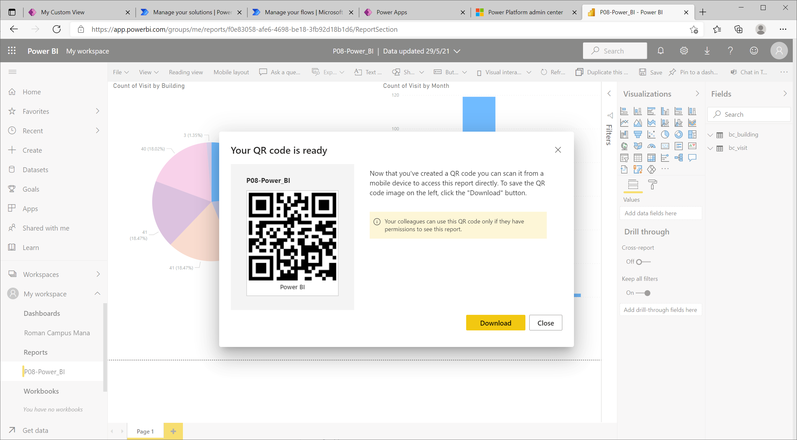
