---
lab:
    title: 'Lab 8: How to build a basic chatbot'
    module: 'Module 6: Intro to Power Virtual Agents'
---

# Module 6: Intro to Power Virtual Agents
# Exercise \#1: Sign up for PVA and Create a New Bot

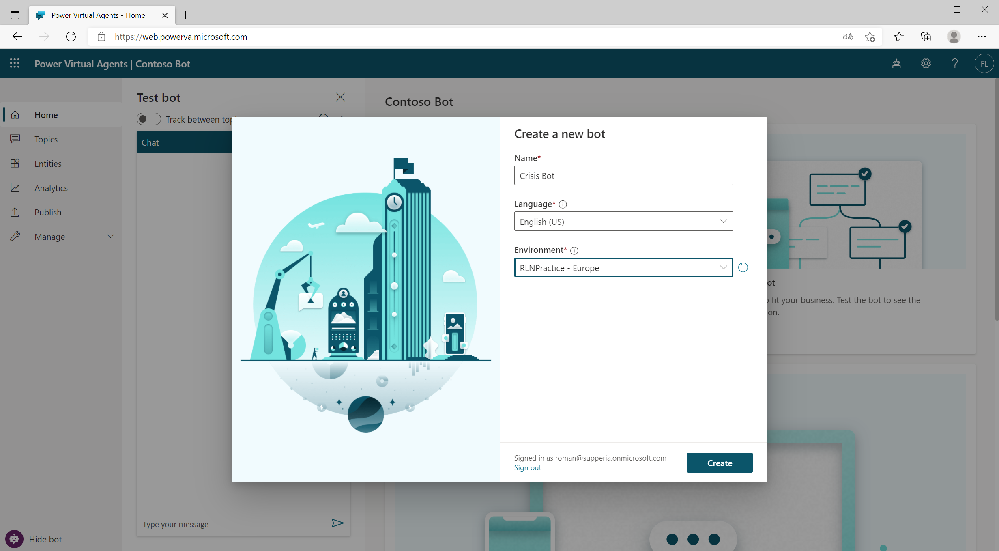

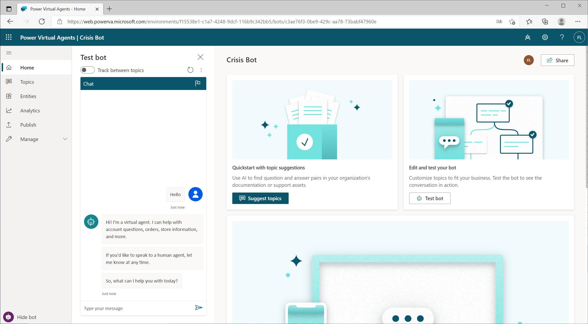

# Exercise \#2: Create Topics

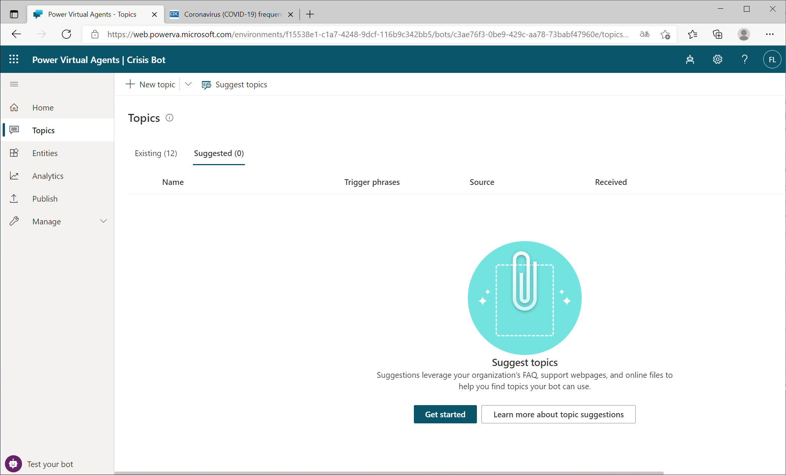

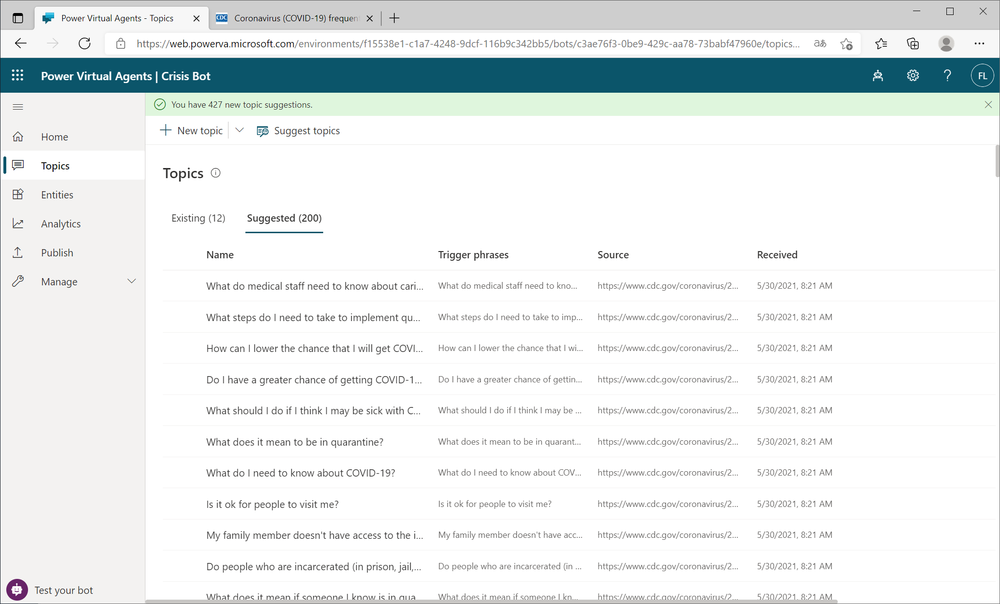

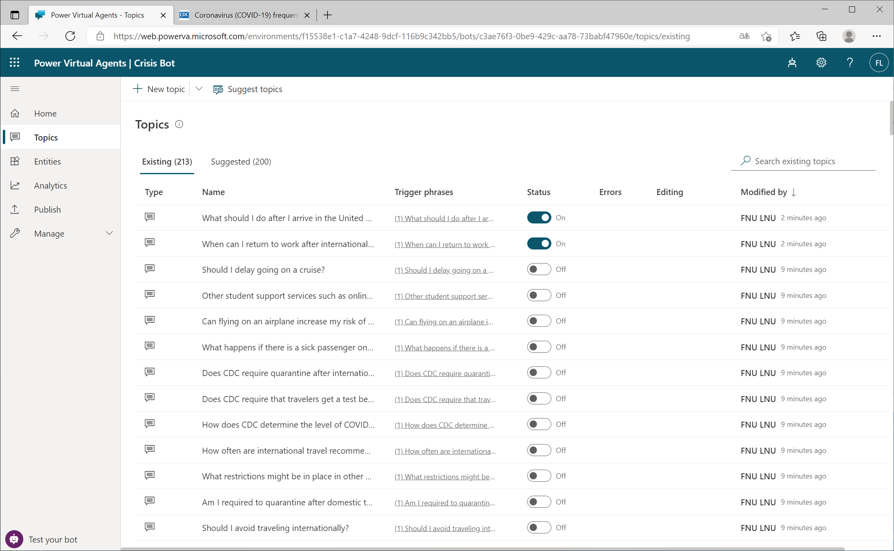

# Exercise \#3: Test Topics

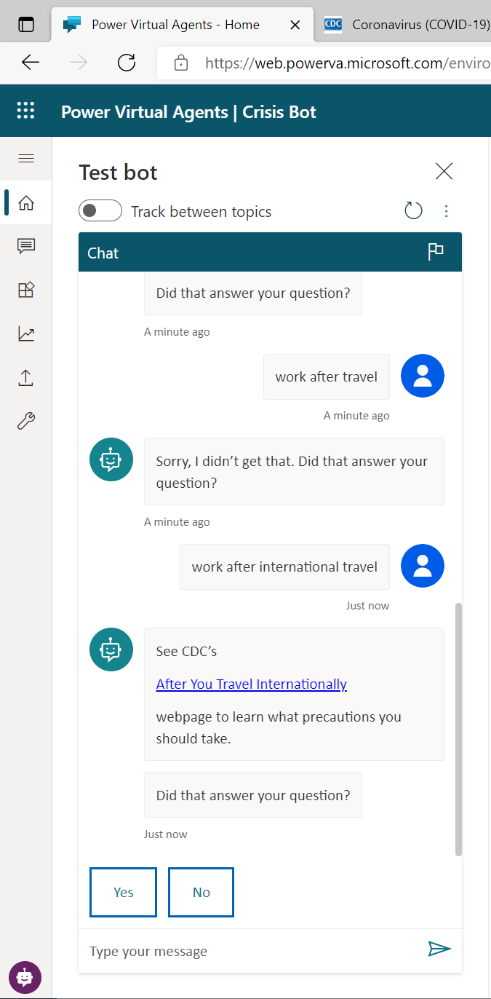

# Exercise \#4: Change the Greeting

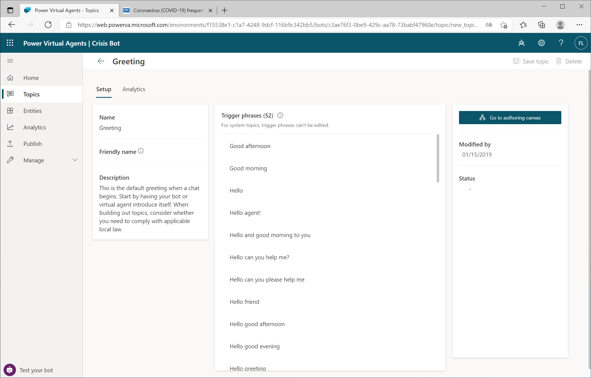

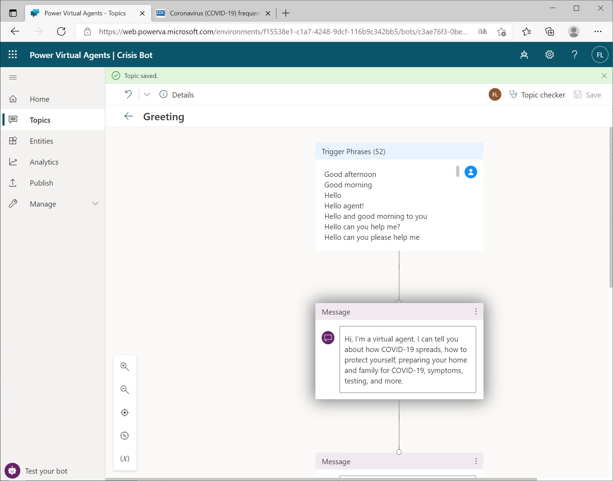

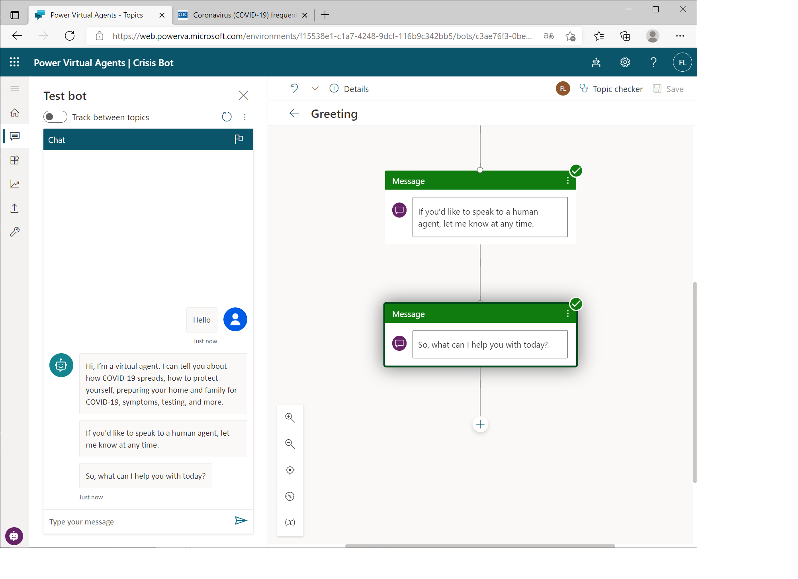

# Exercise \#5: Publish the Bot

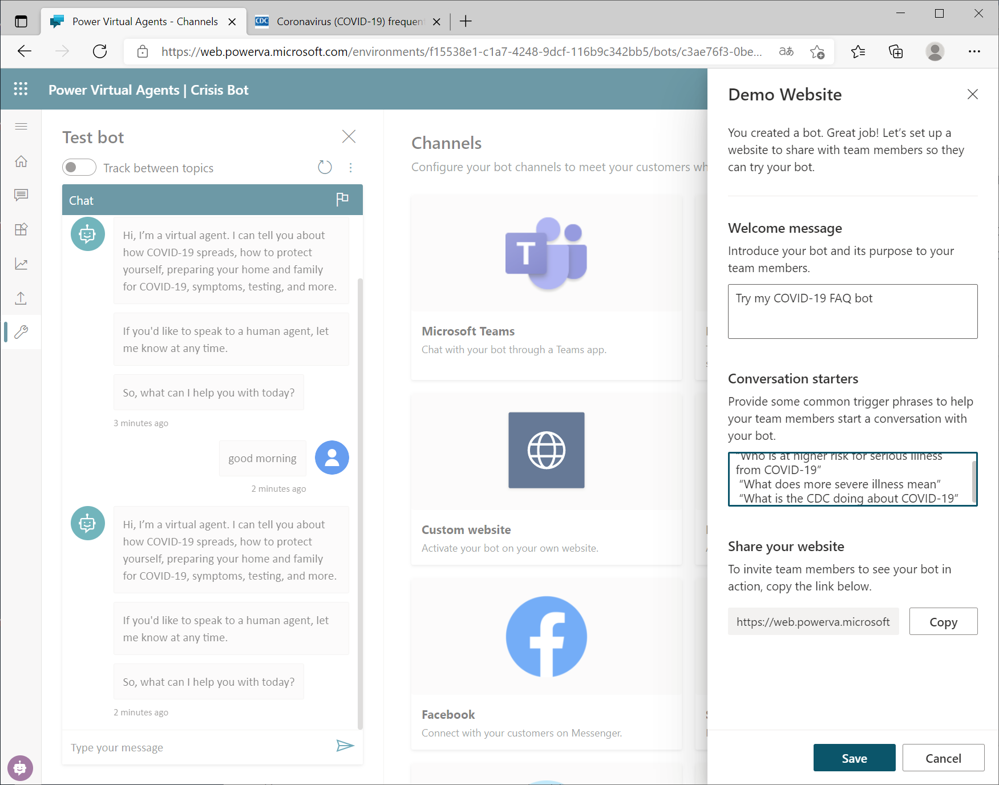

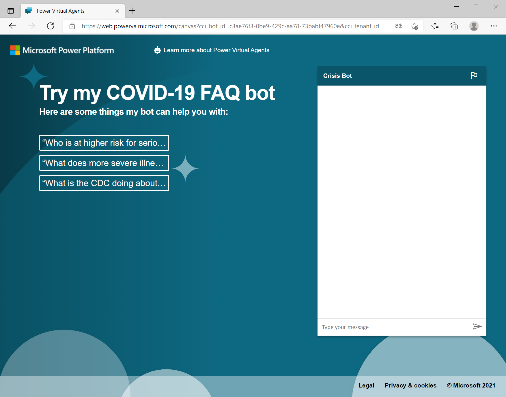

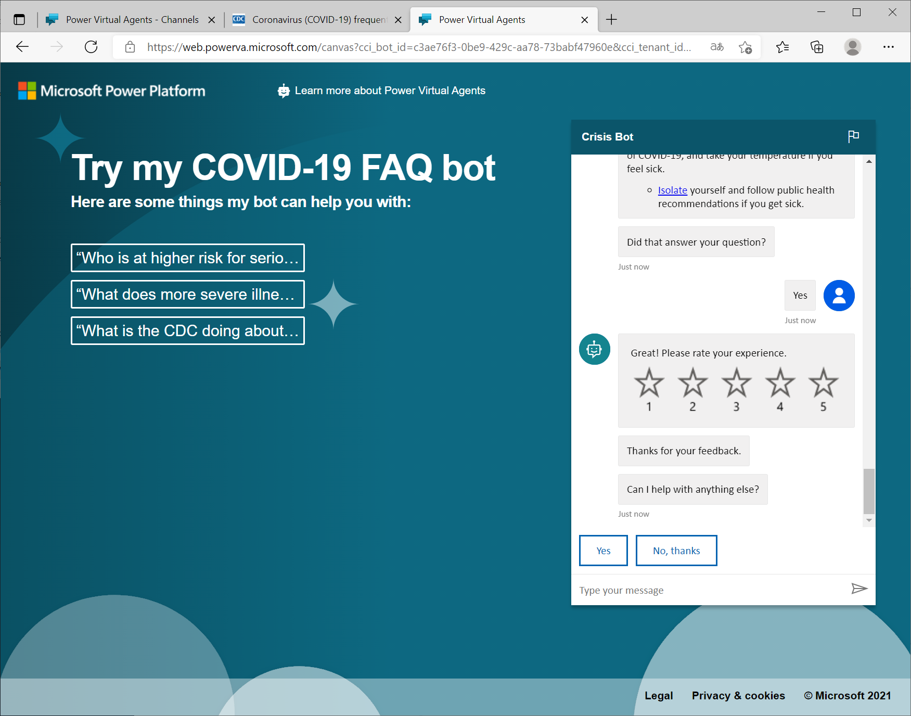
